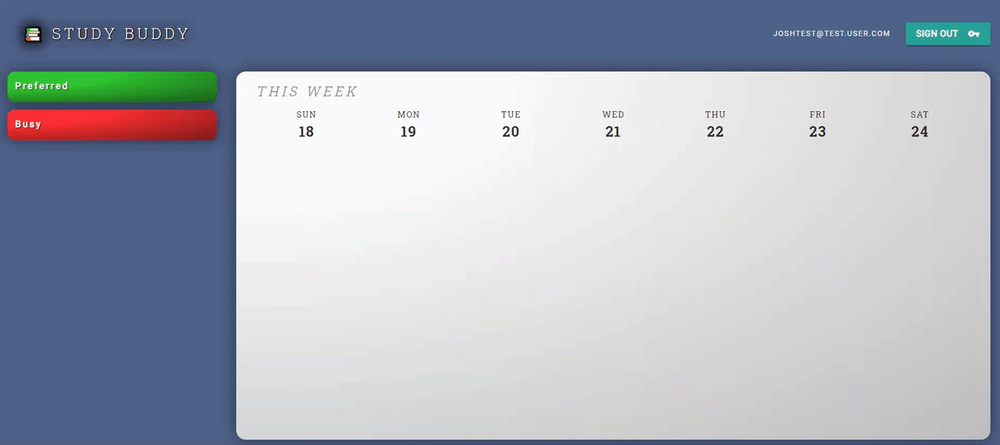
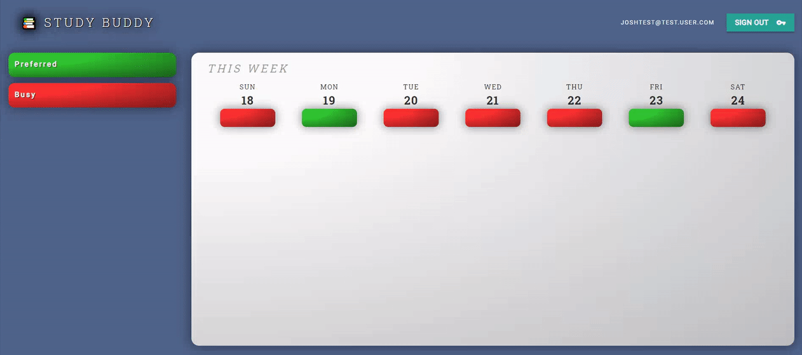
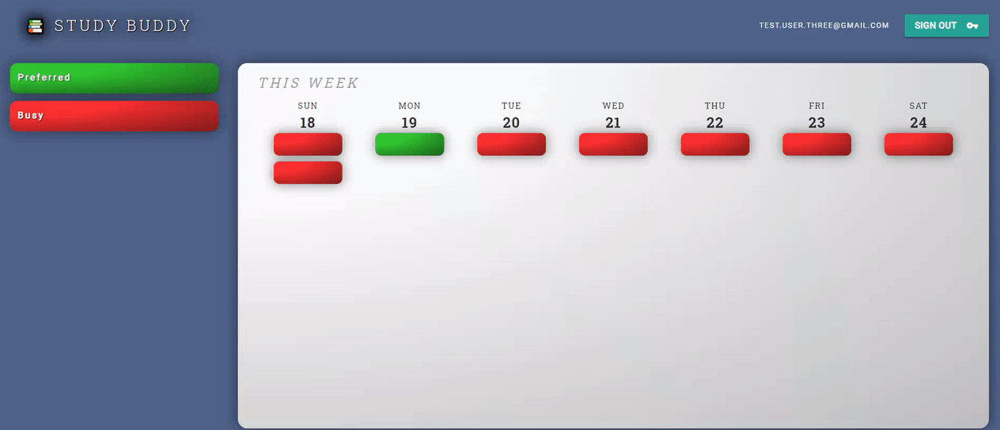

# Study-Buddy

### StudyBuddy is an app designed to let students arrange study sessions. It helps organize your schedule and strengthen your network. It offers weather data, maps, and directions to study session meet ups.

> Instructions for use:

1. login uses email, yourname@test.com
2. password is not restricted, not publicly available

> Group selection:

1. Seattle Central is a group in use.
2. Enter a new study group name to create an empty group, eventually add people to join

> App Use:

1. Drag and drop green and red buttons to days of the week you are available to study
2. Refresh the page to see others users availability overlaid with yours
3. Click on study events to reveal card containing location, weather and directions to meet up

GIFS of application in use:

- Register a User
  

- Add preferred and unavailable times
  

- Choose preferred time, access weather, and set location
  

- Logout and Login
  

Technologies Used:

- Google Maps and Places API
- Open Weather API
- CSS/HTML
- Materialize Framework
- Javascript
- Firebase

Developers/App Creators: Andrew Miller, Josh Cosson, Eric Choi, Eric Vongsay, Patrick Schroedl
